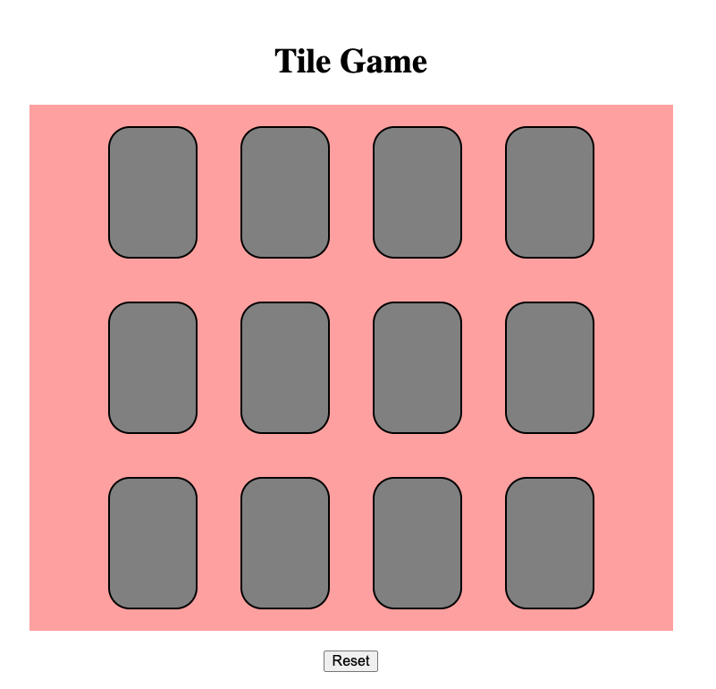

# TILE MEMORY GAME

Rules: Click on the tiles to reveal a color, click on another tile to find the matching color.
Tiles stays open once matched. Complete the game by matching all tiles!
Click Reset to play again!

# Screenshot

# Technologies Used

- JavaScript
- HTML
- CSS

# Getting Started

CLICK TO PLAY!

http://127.0.0.1:5500/index.html

# Future Enhancements

- Timed game, player tries to complete a game within a time frame

- Scoreboard, keep track of players streak

- Hide Reset button, to make it only appear after game completion

# References

1. https://www.shecodes.io/athena/8553-centering-a-horizontal-list-with-flexbox-in-css#:~:text=To%20center%20a%20horizontal%20list,to%20center%20the%20list%20horizontally.

2. https://www.w3schools.com/js/default.asp

3. https://www.w3schools.com/tags/att_input_type_reset.asp

4. https://www.w3schools.com/jsref/met_loc_reload.asp
